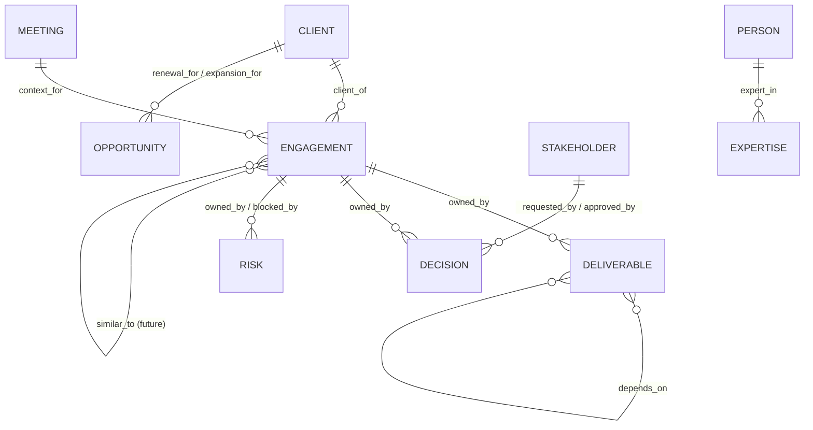
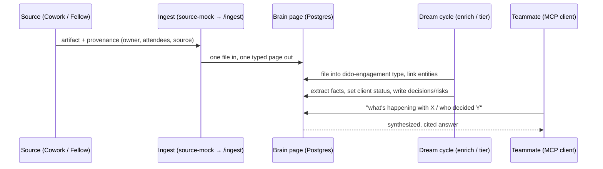

# Consulting Brain — MVP

> **Status:** current
> **Last updated:** 2026-06-29
> **Primary code:** `gbrain/` (schema packs in `src/core/schema-pack/`, skills in `gbrain/skills/`), `source-mock/` (ingest), `docs/`
> **Related docs:** [system-design overview](./overview.md), [consulting-brain proposal](../consulting-brain-proposal.md), [schema packs](../../gbrain/docs/architecture/schema-packs.md)
> **Linear:** [DiDO project](https://linear.app/sierra-studio/project/dido-81894c211fd5/overview) — issues BLU-508 … BLU-518

## Summary

The Consulting Brain reshapes DiDO around the **client engagement** as the primary object, so Sierra's everyday work (meetings, Cowork sessions, deliverables, decisions) is captured as structured, queryable knowledge instead of a flat pile of notes. It is delivered as a **layer on top of the existing DiDO brain** — a GBrain *schema pack* (`dido-engagement`) plus a *skillpack* (`dido-consulting`) — leaving the engine, retrieval, citations, dream cycle, and multiplayer architecture unchanged.

The single most important thing to understand: the work splits into **store intelligently now** and **extract more later**. We invest first in the ontology, importance model, and capture/filing so that all company data lands well-structured as it accumulates. Higher-order extraction (pattern library, deep decision memory) is deliberately deferred, because a well-structured store makes it cheap to build later. Data is shared in **one engagement source open to all of Sierra** — democratized visibility is the point.

## The two-phase principle

- **Store intelligently (MVP, milestone "Store Intelligently").** Get the ontology, importance/tiering, and capture/provenance right. Every artifact files into a real type with its owner, attendees, and source linked. This is the foundation.
- **Extract more (Future, milestone "Extract More").** Mine the structured store: "what have we solved like this?" (pattern library) and "why did we change our mind?" (deep decision memory). Deferred — and far cheaper because the data was stored well.

Two supporting workstreams run as **their own parts** of the project: **Ingestion** (getting artifacts in) and **Dreaming / Always-On Host** (running enrichment on a schedule).

## Ontology

The engagement is the gravity center; clients, stakeholders, deliverables, decisions, and risks orbit it.

**Page types** (each maps a path prefix to a primitive with `extractable` / `expert_routing` flags): `client`, `engagement`, `stakeholder`, `deliverable`, `decision`, `risk`, `opportunity`, `expertise`, `asset`, and base `meeting`. `expert_routing` is set on `stakeholder` + `expertise` only for the MVP. **Link verbs:** `client_of`, `owned_by`, `context_for`, `requested_by`, `approved_by`, `depends_on`, `blocked_by`, `expert_in`, `renewal_for` / `expansion_for`, and `similar_to` (reserved for the future pattern library). Each verb materializes via `frontmatter_links` in the direction its field points; the inverse reading (e.g. engagement `owns` its decisions) comes from backlink traversal, not a separate verb. Full corrected mapping in [`docs/mvp-execution-plan.md` §3](../mvp-execution-plan.md); the [proposal §7](../consulting-brain-proposal.md) is the historical sketch, superseded on specifics.

## Tickets

Grouped by milestone. Each ticket states what it does and why it's in this phase.

### Milestone: Store Intelligently (MVP)

| Ticket | What | Why now |
| --- | --- | --- |
| [BLU-508](https://linear.app/sierra-studio/issue/BLU-508) | Author + activate the `dido-engagement` schema pack | Without the ontology, every artifact is a generic note. This is the foundation everything else reads. |
| [BLU-509](https://linear.app/sierra-studio/issue/BLU-509) | Client lifecycle status (derived, with override) | Label/filter accounts by where they stand — Prospect / Active / Past / Lost, derived from engagement state. No scoring; all engagements matter equally. |
| [BLU-510](https://linear.app/sierra-studio/issue/BLU-510) | Capture, filing + provenance | Artifacts must file into the right type with owner/attendees/source linked — this is also how "who" questions are answered. |
| [BLU-511](https://linear.app/sierra-studio/issue/BLU-511) | Skills — account & status (Client Brief, Weekly Account Health, Executive Summary) | Turn the structured store into account visibility. |
| [BLU-512](https://linear.app/sierra-studio/issue/BLU-512) | Skills — meeting, risk & decision capture (Meeting Prep, Risk Review, Decision Log) | Capture decisions and risks as structured pages — the highest-value objects. |
| [BLU-513](https://linear.app/sierra-studio/issue/BLU-513) | Skills — growth & reuse (Opportunity Finder, Proposal Writer, Deliverable Reuse, Expertise Mapper) | Make accumulated knowledge reusable for delivery and growth. |

### Milestone: Extract More (Future)

| Ticket | What | Why later |
| --- | --- | --- |
| [BLU-514](https://linear.app/sierra-studio/issue/BLU-514) | Pattern library — `similar_to` (Similar Client Finder, Case Study Generator) | "What have we solved like this?" Quality depends on an already-full, well-typed store; prototype before committing. |
| [BLU-515](https://linear.app/sierra-studio/issue/BLU-515) | Decision memory + lessons-learned synthesis | "Why did we change our mind?" Needs accumulated decision timelines; easier once capture is in place. |
| [BLU-518](https://linear.app/sierra-studio/issue/BLU-518) | Account health scoring (ARR / risk / renewal → priority) | Scored Tier 1/2/3 on top of lifecycle status — judgment that needs accumulated history and a value-weighting decision. |

### Workstream: Ingestion Pipeline

| Ticket | What |
| --- | --- |
| [BLU-516](https://linear.app/sierra-studio/issue/BLU-516) | Artifact adapters (Cowork, Fellow, decks/PDFs) → `POST /ingest`, carrying provenance. Builds on `source-mock/`. |

### Workstream: Dreaming and Always-On Host

| Ticket | What |
| --- | --- |
| [BLU-517](https://linear.app/sierra-studio/issue/BLU-517) | Move off the laptop to an always-on host; provision dream-cycle inference so enrichment + tiering run on a schedule. |

## Key flow — an artifact becomes structured knowledge

How a Cowork session or Fellow meeting lands as queryable, tiered, provenance-linked knowledge.

## Design decisions and trade-offs

- **Layer, not fork (schema pack + skillpack).** The consulting behavior is configuration the engine reads at runtime, so DiDO keeps pulling upstream GBrain improvements. *Trade-off:* behavior is bounded by what packs and skills can express.
- **One shared engagement source, open to all of Sierra.** Matches DiDO's democratized-visibility thesis and keeps the future pattern library cheap (no cross-source federation). *Trade-off:* no per-client confidentiality boundary — acceptable for an internal 25-person studio brain.
- **Provenance = per-human identity.** Knowing meeting attendees and a session's owner gives the "who knew / who decided / who did this" graph. *Trade-off:* per-human *audit of writes* still comes from git history, not a per-person request log.
- **Store first, extract later.** Ontology + capture before pattern library + decision synthesis. *Trade-off:* the flashiest features wait until the store has enough well-typed data to make them trustworthy.
- **Ingestion and Dreaming as separate workstreams.** They gate value (tiering and enrichment only run when the dream cycle runs) but evolve independently of the consulting layer.

## For agents

- **Add or change a page type / link verb** → edit the `dido-engagement` pack, then `gbrain schema validate` + `gbrain schema sync --apply`. Pattern: `gbrain/docs/what-schemas-unlock.md`, worked example `gbrain/src/core/schema-pack/base/gbrain-recommended.yaml`.
- **Add a consulting skill** → author in the `dido-consulting` skillpack; reuse the borrowed base skill named in each ticket (e.g. `briefing`, `query`, `cron-scheduler`, `signal-detector`, `find_experts`, `meeting-ingestion`).
- **Tiering runs in the dream cycle** → `runCycle` in `gbrain/src/core/cycle.ts`; it only runs when a worker is up (see BLU-517).
- **Ingest contract** → `POST /ingest` in `gbrain/src/commands/serve-http.ts`; client in `source-mock/`.
- **Depth / rationale** → [the proposal](../consulting-brain-proposal.md) (ontology §7, tiering §8, skills §9, decision memory §10, pattern library §11, confidentiality §13).
