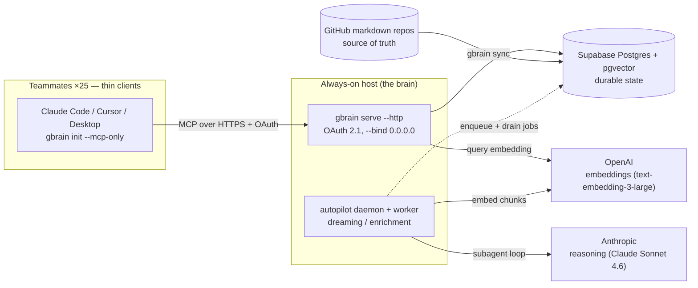
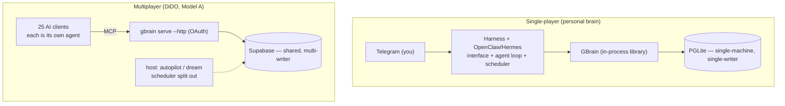
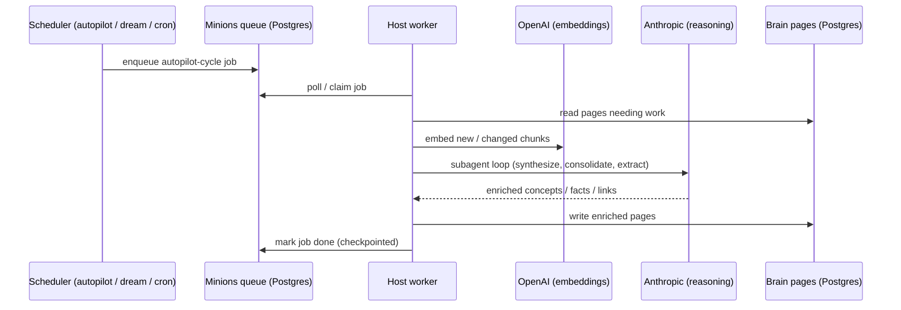

# DiDO — Company Brain (System Design Overview)

> **Status:** current
> **Last updated:** 2026-06-24
> **Primary code:** `gbrain/` (the GBrain fork), `docs/`
> **Related docs:** [company-brain tutorial](../../gbrain/docs/tutorials/company-brain.md), [GBrain INSTALL](../../gbrain/docs/INSTALL.md), [RLS and you](../../gbrain/docs/guides/rls-and-you.md)

## Summary

**DiDO** is Sierra Studio's multiplayer **company brain** — a fork of [GBrain](https://github.com/garrytan/gbrain) serving ~25 people. The whole system is one always-on host running `gbrain serve --http` over a managed **Supabase Postgres + pgvector** database, with each teammate connecting as a **thin, OAuth-scoped MCP client** (Claude Code, Cursor, Claude Desktop). The source of truth is **private GitHub markdown repos**; Postgres is a rebuildable cache. There is **no central chat agent** (no Hermes/OpenClaw) — each teammate's own AI client *is* their agent.

The single most important thing to understand: **stateless processes over one stateful Postgres.** The serve process, the dreaming/enrichment worker, and every thin client are disposable; all durable state (pages, embeddings, job queue, OAuth clients, locks) lives in Supabase. That is what makes the brain multiplayer, restartable, and independent of any one machine.

## Context diagram

How DiDO sits among its parts. Solid arrows = synchronous/strong; dotted = asynchronous/scheduled.

**Components in this diagram:**
- **Thin clients** — each teammate runs their own MCP-aware AI client configured with `gbrain init --mcp-only`. No local database; every operation routes to the host over HTTPS with the client's OAuth token attached.
- **`gbrain serve --http`** — the brain's network front door. Exposes GBrain's ~90 operations as HTTP MCP, enforces OAuth scope + `localOnly` before any handler runs. Lives in `gbrain/src/mcp/`.
- **autopilot daemon + worker** — the host-side scheduler/executor for the dream cycle (see [Key flows](#dream-cycle--inference)).
- **Supabase Postgres + pgvector** — all durable state. pgvector installed in the **`public`** schema.
- **GitHub markdown repos** — the system of record; `gbrain sync` imports them into Postgres.
- **OpenAI / Anthropic** — the two inference providers (embeddings vs reasoning), called from the host.

## Components

| Component | Responsibility | Code location | Tech |
| --- | --- | --- | --- |
| Brain server | Expose ~90 ops as HTTP MCP; OAuth 2.1 auth; scope/`localOnly` enforcement; `/admin` dashboard | `gbrain/src/mcp/` (`server.ts`, `http-transport.ts`, `dispatch.ts`) | Bun + MCP |
| Durable state | Pages, chunks, embeddings, Minions job queue, OAuth clients, locks, sync checkpoints | Supabase (managed) | Postgres + pgvector |
| Knowledge repos | Source of truth; git is canonical, Postgres is a rebuildable cache | separate private GitHub repos | Markdown |
| Thin clients | Per-teammate agent; talks to the brain over MCP, no local engine | `gbrain init --mcp-only` | Claude Code / Cursor / Desktop |
| Scheduler + worker | Run the maintenance/enrichment cycle; enqueue + drain jobs | `gbrain/src/commands/autopilot.ts`, `dream.ts`, `src/core/cycle.ts`, `src/core/minions/` | Bun daemon (launchd/systemd) |
| Inference — embeddings | Vectorize chunks and queries | configured `embedding_model` | OpenAI `text-embedding-3-large` (1536d) |
| Inference — reasoning | Subagent tool-loop for synthesis/enrichment | `src/core/minions/handlers/subagent.ts`, `src/core/model-config.ts` | Anthropic Claude Sonnet 4.6 |

## Key flows

### Why there is no Hermes — single-player vs multiplayer

The personal-brain (single-player) setup runs an always-on agent — a harness + OpenClaw deployment (Hermes) — that **fuses three jobs**: the chat interface, the agent/skills loop, and the scheduler, all wrapped around GBrain running as an in-process library on **PGLite** (single-machine, single-writer). One process must embody the brain because it has no network door and no multi-user store.

Going multiplayer **disaggregates** those jobs. Supabase turns the brain into a shared, multi-writer, network-accessible store; `gbrain serve --http` + OAuth makes the operations a network service; and each teammate's own AI client supplies the interface + agent loop. The scheduler splits out to the host. Nothing Hermes did disappears — it is distributed to better-fitting pieces.

> Caveat: Hermes is redundant *in Model A* (everyone has their own client). A shared Telegram/Slack bot for non-technical teammates would re-introduce one OpenClaw — "Model B" — pointed at the same Supabase brain.

### Dream cycle + inference

"Dreaming" is overnight maintenance/enrichment: synthesize concepts, consolidate, extract facts, resolve links, grade takes. It is a **scheduled stateless batch job** — the same primitive (`runCycle` in `gbrain/src/core/cycle.ts`) whether fired by the persistent `gbrain autopilot` daemon, the one-shot cron-friendly `gbrain dream`, or an external scheduler. Because all state is in Postgres, *who* triggers it is decoupled from *what* executes it — but a **worker must be running on the host** to drain the queue.

**The inference split is load-bearing.** Embeddings run on OpenAI (`text-embedding-3-large`, 1536d). The reasoning subagent loop is **Anthropic-shaped by design** — `TIER_DEFAULTS.subagent = anthropic:claude-sonnet-4-6` and the loop in `src/core/minions/handlers/subagent.ts` makes Anthropic Messages API calls with prompt caching. Routing it to a non-Anthropic provider "silently breaks" the loop, so the subagent tier never inherits a non-Anthropic `models.default` (`isAnthropicProvider` guard in `gbrain/src/core/model-config.ts`). Triggering it remotely: a client with the **`admin`** scope can `submit_job(name: "autopilot-cycle")` over MCP (`gbrain/src/core/operations.ts`); `shell` jobs are CLI-only.

## Design decisions & trade-offs

The decision log — the "why" behind the stack. Each is **decision → rationale → trade-off**.

1. **Model A multiplayer; thin clients; no central agent.** Each teammate's client is its own agent over MCP. *Trade-off:* no shared bot for non-technical users without adding a Model B OpenClaw later.
2. **Supabase Postgres + pgvector (paid tier).** Connect as the **`postgres` role** — it holds `BYPASSRLS`, which GBrain's RLS migrations (v24/v29/v31/v32) hard-require. *This rules out Neon* (its `neondb_owner` lacks `BYPASSRLS`). Transaction pooler `:6543` for reads/writes (IPv4, prepared statements auto-disabled); session pooler `:5432` via `GBRAIN_DIRECT_DATABASE_URL` for DDL/locks on IPv4-only hosts; `max_connections` ≥ 100. *Trade-off:* paid tier + a second connection string to manage.
3. **pgvector in the `public` schema.** GBrain references the `vector` type **unqualified** (`vector(1536)` in `src/schema.sql`) and never adds `extensions` to the connection `search_path`. *Trade-off:* ignores Supabase's "use the `extensions` schema" nudge — but installing there causes `type "vector" does not exist` at migration time.
4. **GitHub markdown repos as source of truth, separate from code.** One repo per source (`shared`/`customers`/`internal`) so per-source GitHub access control maps cleanly onto OAuth scoping. Postgres is a rebuildable cache (`rebuild → sync → extract`). *Trade-off:* more repos to manage; sync latency between a git push and the brain.
5. **OAuth 2.1, one `client_credentials` client per teammate.** Source scoping (`--source` for write, `--federated-read` for read) is the **only** isolation primitive. *Flag gotcha:* `--scopes "read write"` (space-separated, quoted) — a comma throws `InvalidScopeError`. *Trade-off:* identity is per-client, not per-human (see gaps).
6. **`gbrain serve --http --bind 0.0.0.0`** + `GBRAIN_HTTP_CORS_ORIGIN`. Since v0.34 the server binds to `127.0.0.1` by default, which blocks remote teammates. *Trade-off:* must front it with a real hostname + TLS in production.
7. **Dreaming = scheduled stateless batch job.** State in Postgres → the process is disposable and resumable. Run it via the autopilot daemon, one-shot `gbrain dream`, an external cron, or remote `submit_job(autopilot-cycle)`. *Trade-off:* something must still drain the queue — the brain doesn't enrich itself with no worker running.
8. **Inference split.** Embeddings = OpenAI `text-embedding-3-large` (1536d) — **hard to change after content exists** (requires re-embedding the whole corpus). Reasoning = Anthropic Claude Sonnet 4.6, needs `ANTHROPIC_API_KEY`; alternatively `agent.use_gateway_loop true` runs the loop on OpenAI `gpt-5.2` but "runs hot" (no prompt caching, cost scales with conversation length). *Trade-off:* two providers, two bills.
9. **Search mode** currently `tokenmax`; **`balanced` recommended** for a 25-person server (graph/relational retrieval on, no LLM expansion, ~4–5× lower per-query downstream cost). Reversible anytime via `gbrain config set search.mode <mode>` — no re-embedding. *Trade-off:* `tokenmax` gives max retrieval quality at materially higher per-query cost at team scale.
10. **Fork dev loop.** `bun install && bun link` runs `gbrain` live from `src/cli.ts` (bin → `src/cli.ts`, Bun shebang, no compile). Edits to `src/` are live on next invocation; a running `serve` must be restarted (or use `bun --watch`); schema edits need `gbrain apply-migrations`. *Trade-off:* don't `bun install -g github:garrytan/gbrain` — that shadows the fork with upstream.

## Current status (snapshot, 2026-06-24)

- Brain **initialized** on Supabase: schema **v119** (latest), RLS on **61/61** tables, pgvector OK, prepared statements correctly disabled for the `:6543` pooler. `gbrain doctor` = **80/100** (the empty-brain floor — warnings are "no content yet", not defects).
- **No sources/content** synced yet; **no OAuth clients** registered.
- **Dreaming is blocked**: chat model is `openai:gpt-5.2`, `ANTHROPIC_API_KEY` unset, `agent.use_gateway_loop` off → `gbrain dream` / `agent run` / `autopilot` fail at job submission.
- **Host = a MacBook** (prototyping) → dreaming only runs while the laptop is awake.
- Schema pack `gbrain-base` active; **`gbrain-base-v2`** successor available.

## Next steps (ordered)

1. **Lock the embedding provider** (OpenAI vs ZeroEntropy) — *before* any content, since it's painful to change later.
2. **Provision dreaming inference** — set `ANTHROPIC_API_KEY` (recommended) or `gbrain config set agent.use_gateway_loop true`.
3. *(Optional)* `gbrain onboard` — preview/apply the `gbrain-base-v2` pack upgrade while the brain is empty.
4. *(Optional)* revisit search mode → `balanced`.
5. **First content loop:** create knowledge repo(s) → `gbrain sources add` → `sync` → `embed --stale` → first `gbrain think`.
6. **Move to an always-on host** (small cloud VM) → `gbrain autopilot --install`, or wire a nightly `gbrain dream` GitHub Action so dreaming never depends on the laptop.
7. **Register one OAuth client per teammate**; onboard via the botmaster pattern (pre-populate slice → walk through wow flows → graduate to direct use).
8. **Ingestion pipelines** — Gmail ships; Slack/Clerk are DIY (a signature-verifying relay re-POSTing to `POST /ingest`).

## Operational notes & known gaps

Honest limitations of GBrain-as-shipped for a true 25-person brain (carry these as risks, not surprises):

- **No per-human identity or audit** — identity is per **OAuth client**, not per person. The audit trail is git history, not a request log keyed to humans.
- **No SSO, no per-page ACLs** — source scoping (`--source` + `--federated-read`) is the entire access model. Sensitive content must live in a separately-scoped source.
- **Single-user hot-facts capture** and **no shipped content firewall / PII enforcement** — the `_excluded-people.md` / output-rules conventions are policy you must author and enforce in skills, not a built-in gate.
- **Ingestion is mostly DIY** — the only generic inbound is `POST /ingest` (OAuth bearer + write scope, **no signature verification**). Slack/Clerk webhooks need a signature-verifying relay in front of it. The only built-in HMAC receiver is GitHub's.
- **Dreaming only runs while the host is up** — the reason production wants an always-on host, not a laptop.

## For agents

Pointers that save a future agent a search:
- **Model/provider resolution** → `gbrain/src/core/model-config.ts` (`TIER_DEFAULTS`, `resolveModel`, `isAnthropicProvider`). The subagent tier is Anthropic-only by design.
- **Why dreaming might fail at submission** → `checkSubagentCapability` in `gbrain/src/commands/doctor.ts` (the `chat_model` non-Anthropic + no `ANTHROPIC_API_KEY` + `use_gateway_loop` off gate).
- **The maintenance/enrichment primitive** → `runCycle` in `gbrain/src/core/cycle.ts`; daemon wrapper `gbrain/src/commands/autopilot.ts`; one-shot `gbrain/src/commands/dream.ts`.
- **Remote job submission + the shell-job guard** → `submit_job` in `gbrain/src/core/operations.ts`; queue in `src/core/minions/`.
- **HTTP MCP / OAuth / scope enforcement** → `gbrain/src/mcp/` (`http-transport.ts`, `dispatch.ts`, `server.ts`).
- **Source-of-truth & DR philosophy, full setup detail** → [company-brain tutorial](../../gbrain/docs/tutorials/company-brain.md) and the `dido-deployment-stack` project memory (the source-traced runbook). This doc is design-level; the runbook has the exact commands.

## Glossary

- **Brain** — which database. DiDO's brain is one Supabase Postgres.
- **Source** — which repo inside the brain (`shared`, `customers`, `internal`). Slugs are scoped per source; isolation is enforced at the SQL layer.
- **Model A / Model B** — Model A: separate sources + per-client OAuth scoping, each teammate brings their own AI client (DiDO's choice). Model B: one source + one fat agent serving everyone over a shared interface.
- **Thin client** — `gbrain init --mcp-only`; a client that routes everything to a remote brain and runs no local engine.
- **Dream cycle** — overnight maintenance/enrichment (`runCycle`); makes the brain "smarter" while you sleep.
- **Subagent loop** — the Anthropic Messages API tool-loop that powers the reasoning phases of the dream cycle.
- **`--federated-read`** — the OAuth flag listing which sources a client may read; the read-side counterpart to the single writable `--source`.
